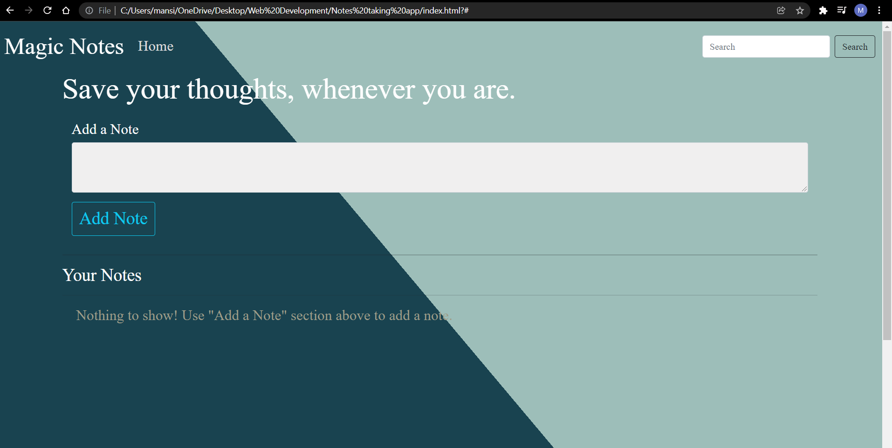
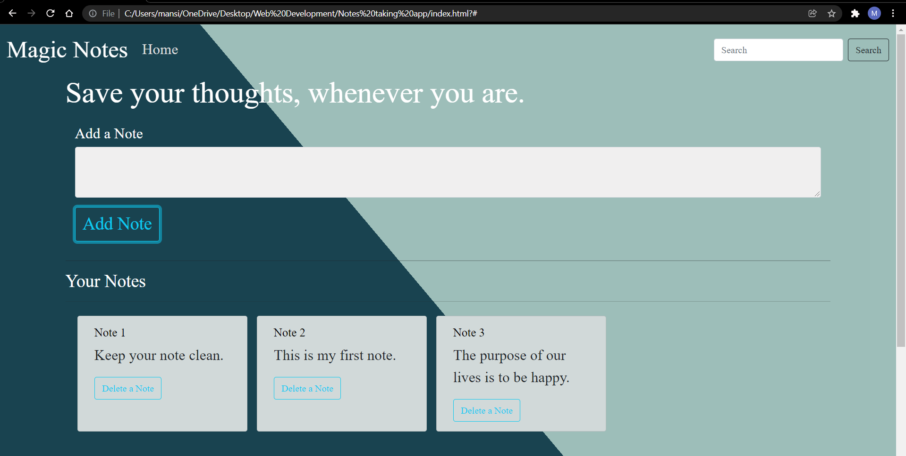
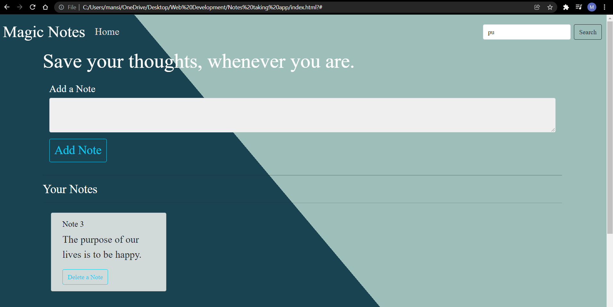
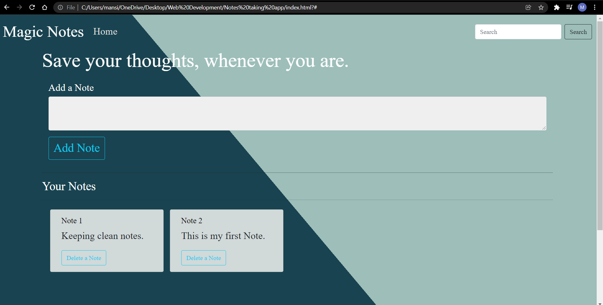

# Notes-taking-app
<h5>This is a full stack we application. In which user can add, delete, read tand search heir notes. The data will be stored in localstorage.</h5>

<h2>Installation</h2>
<h5> To install, simply clone this repository & smiply run the following by copying the html file path on your web browser.</h5>

<h2>Running Project</h2>
<h5>o run this project locally, copy the following html file path and run on the web browser, this will start a local instance of the application & you will be able to run the app in your browser.</h5>

<h2>Welcome Page</h2>
<h5>Here the user can add, delete, read and search the notes. The user can save their thoughts, whenever they are. And the data will be store in local storage.</h5>

<h2>Add a Note</h2>
<h5></h5>

<h2>Search a Note</h2>
<h5></h5>

<h2>Delete a Note</h2>
<h5></h5>

